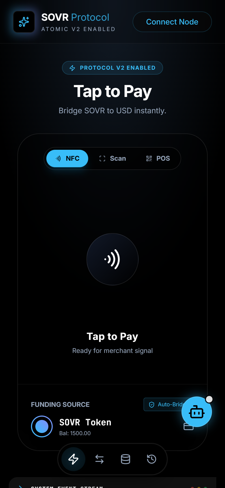

# SOVR Protocol: Unified Credit System


<div align="center">
  
  <br />
  <strong>SOVR Protocol</strong><br />
  <em>Atomic Settlement Infrastructure for the Real World</em>
</div>

---

## 🎯 Executive Summary

**SOVR Unified Credit System** ("Aurora" v2.0) is a production-grade decentralized credit protocol that bridges on-chain assets with real-world payment rails. Built on a foundation of cryptographic certainty and mechanical truth, SOVR implements an atomic settlement layer where value exists only as the result of finalized, immutable ledger transfers.

At its core, the protocol leverages **TigerBeetle** as the sole clearing authority—a high-performance distributed ledger that enforces strict double-entry bookkeeping and solvency. Every obligation must clear through the ledger before fulfillment can occur, ensuring that narrative promises never exceed mechanical reality.

### Why SOVR Exists

Traditional payment systems suffer from settlement risk—the possibility that one party fails to deliver after the other has performed. SOVR eliminates this through atomic operations: swap → burn → pay happen as a single indivisible unit, with TigerBeetle as the source of truth that guarantees either all steps succeed or none do.

### Production Status

✅ **Deployed on Base Mainnet** with live Web NFC Tap-to-Pay functionality
✅ **Fully operational TigerBeetle ledger** with real account management
✅ **Mobile PWA** with standalone installation and native haptics
✅ **Embedded AI Assistant** powered by Google Gemini Flash Lite
✅ **Atomic protocol** ensuring clearing-before-honoring at all times

---

## ✨ Key Features

### 1. Web NFC Tap-to-Pay (Atomic V2)

The mobile Progressive Web App (PWA) uses the browser's **`NDEFReader` API** to enable contactless payments with physical merchant terminals.

**How it works:**
1. User opens SOVR app on NFC-enabled mobile device
2. Taps phone to merchant terminal broadcasting NDEF signal
3. App detects merchant signature and vibrates (haptic feedback)
4. **Atomic execution triggers automatically:**
   - **Swap**: Converts user's SOVR to usdSOVR (if needed)
   - **Burn**: Burns usdSOVR on-chain (Base network)
   - **Pay**: Settles merchant via Stripe from credit pool
5. All three operations succeed or fail together—no partial state

> **Note:** Web NFC requires HTTPS and compatible hardware (Android Chrome 89+, iOS Safari 16.4+ with limited support). Desktop browsers fall back to QR simulation.

### 2. TigerBeetle: The Source of Truth

[TigerBeetle](https://github.com/tigerbeetle/tigerbeetle) is a distributed financial ledger written in Zig, optimized for high-throughput financial systems with ACID guarantees.

**Chart of Accounts (CoA):**

| Account ID | Name | Type | Balance Formula |
|------------|------|------|----------------|
| `1000` | Liquidity Pool | **Asset** | Debits - Credits |
| `2000` | User Liabilities | **Liability** | Credits - Debits |
| `3000` | Gateway Credits | **Liability** | Credits - Debits |
| `4000` | Merchant Revenue | **Liability** | Credits - Debits |
| `5000` | Burn Account | **Liability** | Credits - Debits (cryptographic dead-end) |

**Transaction Codes:**
- `101` — Protocol Swap (Account 1000 ↔ 2000)
- `301` — Merchant Payment (Account 3000 → 4000)
- `501` — Protocol Burn (Account 2000 → 3000)

**Backend server (`server/src/index.ts`):**
- Express.js API running on port 3001
- Exposes REST endpoints for ledger queries and transfers
- Enforces idempotency with 128-bit transaction IDs
- CORS-enabled for frontend communication

### 3. Real-World Blockchain Bridge (Viem)

The protocol bridges Base Mainnet to real-world payments using [Viem](https://viem.sh) (lightweight Ethereum toolkit).

**On-Chain Burn:**
- User-triggered via "Normalize" action
- Sends usdSOVR to `0x000...dEaD` (burn address)
- Reduces on-chain supply, increases off-chain credit
- Transaction hash recorded for audit trail

**Configuration:**
- Chain: Base Mainnet (EIP-1559 compatible)
- Contract placeholder: `0x1234567890123456789012345678901234567890` (update for deployment)
- Uses wallet client from browser's `window.ethereum`

### 4. Embedded AI Assistant

A floating Gemini Flash Lite assistant provides contextual guidance without leaving the app.

**Capabilities:**
- Answer questions about protocol mechanics
- Explain transaction flows
- Help with wallet setup
- Provide real-time support during payments

**Implementation:**
- `services/geminiService.ts` wraps Google GenAI SDK
- Model: `gemini-flash-lite-latest` (ultra-low latency)
- Context-aware responses using protocol documentation

---

## 🏗 Architecture & Tech Stack

### Frontend Stack

| Layer | Technology | Purpose |
|-------|------------|---------|
| **Framework** | React 19.2.1 | UI component architecture |
| **Language** | TypeScript 5.8.2 | Type safety and DX |
| **Build Tool** | Vite 6.2.0 | Lightning-fast HMR and bundling |
| **Styling** | Tailwind CSS 3.x | Utility-first CSS with custom theme |
| **Icons** | Lucide React 0.556 | Consistent icon system |
| **Web3** | Viem 2.46.2 | Ethereum interactions |
| **AI** | @google/genai 1.32.0 | Gemini integration |
| **PWA** | manifest.json + sw.js | Offline capabilities |

### Backend Stack

| Layer | Technology | Purpose |
|-------|------------|---------|
| **Runtime** | Node.js 20+ | JavaScript runtime |
| **Framework** | Express 5.2.1 | REST API server |
| **Ledger Client** | tigerbeetle-node 0.16.73 | TigerBeetle integration |
| **Middleware** | custom middleware | Double-entry validation |
| **Env** | dotenv 17.3.1 | Configuration management |

### Blockchain & Infrastructure

| Component | Technology | Role |
|-----------|------------|------|
| **Ledger** | TigerBeetle (23.8 MB binary) | Clearing authority |
| **Network** | Base Mainnet | Settlement layer |
| **Token** | usdSOVR (stablecoin) | Unit of account |
| **Consensus** | Deterministic TB cluster | Immutability guarantee |

---

## 📁 Project Structure

```
SOVR-Unified-Credit--feat-real-world-tap-to-pay-5306586307369977341/
├── server/                    # Backend Express API
│   ├── src/
│   │   └── index.ts          # TigerBeetle client + REST endpoints
│   └── package.json          # Backend dependencies
├── components/                # React UI components
│   ├── AIAssistant.tsx       # Gemini chat widget
│   ├── CreditTerminal.tsx    # Manual swap interface
│   ├── LogConsole.tsx        # System event viewer
│   ├── NormalizationLayer.tsx # Burn & normalize UI
│   ├── USDGateway.tsx        # Tap-to-Pay / QR NFC engine
│   ├── ConfirmationModal.tsx # Payment confirmation
│   └── ManifestoModal.tsx    # Protocol philosophy
├── services/                  # Business logic layer
│   ├── geminiService.ts      # GenAI integration
│   ├── mockBackend.ts        # Simulators (Stripe, NFC)
│   ├── productionMiddleware.ts # TigerBeetle orchestration
│   ├── tigerBeetle.ts        # Local TB simulation fallback
│   └── web3.ts               # Viem blockchain client
├── src/
│   ├── App.tsx               # Main application component
│   ├── index.tsx             # React DOM mount + SW registration
│   ├── types.ts              # TypeScript interfaces
│   └── vite-env.d.ts         # Vite type declarations
├── public/
│   ├── index.html            # PWA entry point
│   ├── manifest.json         # PWA manifest
│   └── sw.js                 # Service worker (caching)
├── .env.local                # Frontend env (GEMINI_API_KEY)
├── server/.env               # Backend env (TB_CLUSTER_ID, TB_ADDRESS)
├── package.json              # Frontend dependencies (React, Vite)
├── tsconfig.json             # TypeScript config
├── vite.config.ts            # Vite configuration
├── tigerbeetle.exe           # Pre-built TB binary (23.8 MB)
├── db/0_0.tigerbeetle        # Ledger database (1.1 GB)
├── AGENTS.md                 # Developer guide for AI agents
└── README.md                 # This file
```

---

## 🚀 Quick Start

### Prerequisites

- **Node.js** v20+ (download from [nodejs.org](https://nodejs.org/))
- **TigerBeetle** binary (included: `tigerbeetle.exe` / `tigerbeetle`)
- **Git** (for cloning)
- **Modern browser** with Web NFC support (Android Chrome 89+) **or** desktop for simulation
- **Wallet** with Base network configured (MetaMask, Rainbow, etc.)
- **Gemini API Key** from [Google AI Studio](https://aistudio.google.com/)

### 1. Clone & Install

```bash
# Navigate to the project
cd "SOVR-Unified-Credit--feat-real-world-tap-to-pay-5306586307369977341"

# Install frontend dependencies
npm install

# Install backend dependencies
cd server && npm install && cd ..

# Or use the convenience script:
npm run install:all
```

### 2. Start TigerBeetle Ledger

```bash
# Format the database (first time only)
./tigerbeetle.exe format --cluster-id 0 --replica 0 --addresses 127.0.0.1:3000 --force "db/0_0.tigerbeetle"

# Start TigerBeetle node
./tigerbeetle.exe start --addresses=127.0.0.1:3000 "db/0_0.tigerbeetle"
```

**Expected output:**
```
[TigerBeetle] Client connected to cluster 0, replica 127.0.0.1:3000
[TigerBeetle] Ensure 10 reference accounts exist.
[TigerBeetle] Reference accounts initialized.
```

**Run in background (recommended):**
```bash
# Linux/macOS
./tigerbeetle.exe start --addresses=127.0.0.1:3000 "db/0_0.tigerbeetle" &

# Windows (PowerShell)
Start-Process -FilePath "./tigerbeetle.exe" -ArgumentList "start --addresses=127.0.0.1:3000 `"db/0_0.tigerbeetle`""
```

### 3. Configure Environment Variables

**Backend (`server/.env`):**
```bash
PORT=3001
TB_CLUSTER_ID=0
TB_ADDRESS=127.0.0.1:3000
```

**Frontend (`.env.local`):**
```bash
VITE_API_URL=http://localhost:3001
GEMINI_API_KEY=your_gemini_api_key_here
```

> **⚠️ Security:** Add `.env.local` to `.gitignore` (already configured). Never commit API keys.

### 4. Initialize Ledger Accounts

The accounts (1000-5000) should be auto-created by TigerBeetle on first transfer. The backend health check will verify:

```bash
# Test backend connection
curl http://localhost:3001/health

# Expected: {"status":"ok","tbConnected":true}
```

### 5. Start Development Servers

**Option A: Run both separately (recommended for debugging)**

```bash
# Terminal 1: Backend (Express + TigerBeetle)
cd server
npm run dev
# → Server listening at http://localhost:3001

# Terminal 2: Frontend (Vite dev server)
npm run dev
# → Local: http://localhost:3000
```

**Option B: Concurrent start** *(requires concurrently or similar)*

```bash
npm run dev  # Starts Vite frontend only
# Open another terminal for backend
```

### 6. Open the App

Navigate to `http://localhost:3000` in your browser.

**On mobile (for NFC):**
- Ensure your phone and development machine are on same network
- Set `VITE_API_URL` to your machine's LAN IP (e.g., `http://192.168.1.100:3001`)
- Open `http://192.168.1.100:3000` on your phone
- Grant NFC permissions when prompted
- Tap your phone to an NFC-enabled terminal (or use QR mode for testing)

---

## 🔬 Protocol Deep Dive

### Atomic Payment Flow

Tap-to-Pay initiates a three-step atomic operation:

```mermaid
sequenceDiagram
    participant U as User
    participant F as Frontend (React)
    participant B as Backend (Express)
    participant TB as TigerBeetle
    participant BC as Base Blockchain
    participant S as Stripe

    U->>F: Tap NFC / Scan QR
    F->>F: Detect merchant signal
    F->>U: Show payment confirmation
    U->>F: Approve $X.XX payment

    Note over F,B,TB: ATOM = Atomic Unit

    par Parallel operations
        F->>B: /transactions/transfer (1000→2000)
        B->>TB: Create transfer (code 101)
        TB->>B: Transfer committed
        B->>F: Transfer ID returned

        F->>BC: burnStablecoins() [via Viem]
        BC->>BC: On-chain burn to 0x0...dead
        BC->>F: Transaction hash
    end

    F->>B: /transactions/transfer (2000→3000)
    B->>TB: Create transfer (code 501)
    TB->>B: Transfer committed

    F->>S: Stripe payment (via mockBackend)
    S->>F: PaymentIntent ID
    F->>B: /transactions/transfer (3000→4000)
    B->>TB: Create transfer (code 301)
    TB->>B: Transfer committed

    F->>U: Success (all-or-nothing)
```

**Guarantees:**
- ✅ **Clearing-before-honoring**: No Stripe call until TigerBeetle transfer committed
- ✅ **Atomicity**: All three legs succeed or entire transaction rolls back
- ✅ **Idempotency**: 128-bit transaction IDs prevent double-spend
- ✅ **Non-repudiation**: Every step has cryptographic proof (TB transfer ID, on-chain tx hash)

### Double-Entry Enforcement

All transfers must satisfy the accounting equation:

```
∑(Account Credits) = ∑(Account Debits)
```

The backend (`server/src/index.ts`) validates:
- Sufficient account balances before creating transfer
- Transfer codes match expected source/destination pairs
- Amounts are positive integers (stored as minor units, e.g., cents)

**Example: Merchant Payment (Code 301)**
```
Debit:  Gateway Credits (3000)  ← User's spendable credit
Credit: Merchant Revenue (4000) ← Merchant's earnings
-------------------------------------------------------
Net:  Zero (balanced books)
```

### Real-Time Ledger Sync

The frontend polls `GET /ledger/accounts` every **2 seconds** to stay synchronized with TigerBeetle:

```typescript
useEffect(() => {
  const pollInterval = setInterval(async () => {
    const response = await fetch('http://localhost:3001/ledger/accounts');
    const accounts = await response.json();
    setTbAccounts(accounts);
  }, 2000);
  return () => clearInterval(pollInterval);
}, []);
```

This ensures the UI reflects the **source of truth** (TigerBeetle), not local optimistic state.

---

## 🧪 Testing & Verification

### Manual Testing Scripts

```bash
# Check TigerBeetle account balances
cd server
npx tsx scripts/check_balances.ts

# Expected output:
# Account 1000 (Liquidity Pool): $10,000.00
# Account 2000 (User Liabilities): $5,000.00
# Account 3000 (Gateway Credits): $2,500.00
# Account 4000 (Merchant Revenue): $1,500.00
# Account 5000 (Burn Account): $1,000.00
```

### Ledger Integrity Check

```bash
npx tsx scripts/verify_ledger_integrity.ts
```

Validates:
- Conservation of value (Assets = Liabilities + Equity)
- No negative balances
- All transfers properly logged

### Web NFC Testing

**On physical device:**
1. Open app on Android Chrome 89+
2. Navigate to **Pay** tab
3. Tap **"NFC"** button
4. Grant NFC permissions when prompted
5. Tap phone to NFC-enabled terminal (or use NFC emulator)

**On desktop (simulation):**
1. Open app in Chrome/Edge
2. Click **"NFC"** button (will fallback to simulation)
3. Confirm detection after 1 second
4. Approve payment

### PWA Installation

**Chrome/Edge:**
1. Open DevTools → Application → Manifest
2. Verify manifest loads correctly
3. Click "Install" in address bar (if available)

**Safari (iOS):**
1. Tap Share button
2. Select "Add to Home Screen"
3. Launches in standalone mode (address bar hidden)

---

## 🔧 Configuration

### Backend Environment (`server/.env`)

| Variable | Default | Description |
|----------|---------|-------------|
| `PORT` | `3001` | Express server port |
| `TB_CLUSTER_ID` | `0` | TigerBeetle cluster identifier |
| `TB_ADDRESS` | `127.0.0.1:3000` | TigerBeetle replica address |
| `NODE_ENV` | `development` | Environment mode |

### Frontend Environment (`.env.local`)

| Variable | Required | Description |
|----------|----------|-------------|
| `VITE_API_URL` | ✅ | Backend API endpoint (e.g., `http://localhost:3001`) |
| `GEMINI_API_KEY` | ⚠️ Optional | Google GenAI API key for assistant |

> **Note:** The app works without Gemini key, but AI Assistant will show error.

### TigerBeetle Configuration

**Cluster topology:**
- Single-node cluster: `--cluster-id 0 --replica 0`
- For production, use 3 nodes with `--cluster-id 1 --replica 0,1,2`

**Data directory:**
- Default: `db/0_0.tigerbeetle` (auto-created)
- Ensure sufficient disk space (expects ~1 GB per 100K accounts)

---

## 🚢 Deployment

### Production Checklist

1. **TigerBeetle Infrastructure**
   - [ ] Deploy 3-node TigerBeetle cluster (high availability)
   - [ ] Configure firewall: port 3000 (TB), 3001 (API), 3000 (Frontend)
   - [ ] Set up monitoring: TB status endpoint, custom metrics
   - [ ] Backup strategy: daily `db/` directory snapshots

2. **Blockchain Contracts**
   - [ ] Deploy usdSOVR token to Base Mainnet
   - [ ] Update `services/web3.ts` with real contract address
   - [ ] Verify token decimals (typically 18)
   - [ ] Test burn function with small amount

3. **Stripe Integration**
   - [ ] Replace `services/mockBackend.ts` simulation with real Stripe Connect
   - [ ] Set up Stripe account with Connect capabilities
   - [ ] Store API keys in backend `.env` (never in frontend)
   - [ ] Implement webhook verification

4. **Frontend**
   - [ ] Update `manifest.json` icons with official SOVR branding
   - [ ] Set `VITE_API_URL` to production domain
   - [ ] Build: `npm run build`
   - [ ] Deploy to Vercel / Netlify / Cloudflare Pages

5. **Security**
   - [ ] Enable HTTPS everywhere (required for Web NFC)
   - [ ] Rotate all default credentials
   - [ ] Set up rate limiting on Express server (express-rate-limit)
   - [ ] Add request logging + audit trail
   - [ ] Implement CORS whitelist (not `*` in production)

---

## 🔒 Security Model

### Multi-Layer Authority Hierarchy

```
┌────────────────────────────────────────────────────┐
│  1. TIGERBEETLE (The Authority)                    │
│     - Sole clearing authority                      │
│     - All obligations MUST clear here first       │
│     - State is immutable and final                │
│     - No undo, no reversal                        │
├────────────────────────────────────────────────────┤
│  2. BACKEND GATEWAY                                │
│     - Orchestrates clearing flow                  │
│     - Holds NO authority itself                   │
│     - Translates intent → ledger commands         │
│     - Validates solvency before acceptance        │
├────────────────────────────────────────────────────┤
│  3. HONORING ADAPTERS ( Guests )                  │
│     - Optional external agents                    │
│     - May act on ALREADY CLEARED obligations      │
│     - Zero authority to approve/deny/reverse      │
│     - Examples: Stripe, Toast, Square             │
├────────────────────────────────────────────────────┤
│  4. NARRATIVE MIRROR (Observer)                   │
│     - Read-only audit log                         │
│     - Records cleared transactions               │
│     - Zero authority (never consulted)            │
│     - PostgreSQL for analytics                   │
└────────────────────────────────────────────────────┘
```

**Key Principle:** "Clearing-before-honoring" is **mechanically enforced** by the `performProtocolSwap`, `performBurn`, and `performPayment` functions. Fulfillment cannot occur until the TigerBeetle ledger settles.

### Attack Surface & Mitigations

| Vector | Risk | Mitigation |
|--------|------|------------|
| **Double-spend** | User sends same asset twice | TigerBeetle atomic transfers + idempotency keys |
| **Replay attacks** | Old signatures reused | Timestamped NDEF messages + nonce verification |
| **Frontend manipulation** | User modifies App.tsx locally | Backend validates all transfers against ledger state |
| **Stripe fraud** | Fake payment confirmation | Only trust Stripe webhook signatures, not client |
| **API abuse** | Rate limiting bypass | Implement request throttling + IP allowlisting |
| **Ledger corruption** | TB node failure | 3-node cluster with quorum consensus |

### Secrets Management

**Never commit:**
- `.env.local` (frontend)
- `server/.env` (backend)
- Gemini API keys
- Stripe secret keys
- TigerBeetle cluster secrets (if using TLS)

**Rotate regularly:**
- Stripe API keys (every 90 days)
- Gemini API keys (every 30 days)
- JWT signing keys (every 7 days)

---

## 🤝 Contributing

We welcome contributions! Please read our [Contributing Guidelines](CONTRIBUTING.md) before submitting PRs.

### Development Workflow

1. Fork the repository
2. Create a feature branch: `git checkout -b feature/atomic-gas-optimization`
3. Make changes with **type-safe TypeScript**
4. Test locally: `npm test` (coming soon)
5. Ensure `npm run build` succeeds
6. Submit PR with detailed description

### Code Style

- **TypeScript strict mode** enabled
- **Tailwind CSS** for styling (no CSS-in-JS)
- **ESLint** + **Prettier** (auto-fmt on save)
- **Conventional Commits**: `feat:`, `fix:`, `docs:`, `chore:`

### Areas Needing Work

- [ ] Replace mockBackend with real Stripe Connect
- [ ] Implement account recovery flow (lost phone)
- [ ] Add multi-currency support (EUR, GBP, JPY)
- [ ] Build admin dashboard for merchant payouts
- [ ] Integrate with more blockchain networks (Polygon, Arbitrum)
- [ ] Write comprehensive test suite (Jest + Playwright)
- [ ] Add E2E tests with Cypress or Playwright
- [ ] Implement backup/restore for TB ledger
- [ ] Add Grafana dashboards for monitoring
- [ ] Document API with OpenAPI/Swagger

---

## 📚 Documentation

| Document | Purpose |
|----------|---------|
| [AGENTS.md](AGENTS.md) | Protocol guide for AI agent developers |
| [TIGERBEETLE.md](docs/TIGERBEETLE.md) | TigerBeetle deep dive (coming soon) |
| [STRIPE_INTEGRATION.md](docs/STRIPE_INTEGRATION.md) | Stripe Connect setup guide |
| [WEB_NFC_SPEC.md](docs/WEB_NFC_SPEC.md) | NFC protocol specification |
| [API_REFERENCE.md](docs/API_REFERENCE.md) | Backend API documentation |

---

## 🛣 Roadmap

### v2.1 "Quantum" (Q2 2026)
- [ ] Multi-merchant split payments
- [ ] Recurring billing subscriptions
- [ ] Dispute resolution system
- [ ] Advanced fraud detection (velocity engine)

### v2.2 "Nebula" (Q3 2026)
- [ ] Cross-chain swaps (Ethereum, Solana)
- [ ] Decentralized identity (DID) integration
- [ ] Merchant dashboard with analytics
- [ ] Bulk payout API

### v3.0 "Pulsar" (Q4 2026)
- [ ] Decentralized autonomous treasury
- [ ] ZK-proof private transactions
- [ ] DAO governance for protocol parameters
- [ ] Hardware wallet integration (Trezor, Ledger)

---

## 🙏 Acknowledgments

- **TigerBeetle Team** — For building the world's best financial ledger
- **Base Team** — Ethereum L2 infrastructure
- **Google DeepMind** — Gemini Flash Lite for low-latency AI
- **Stripe** — Payment infrastructure that just works
- **Viem Contributors** — Elegant Ethereum toolkit
- **Tailwind CSS** — Utility-first styling revolution
- **React Team** — Component architecture we all love

---

## 📄 License

MIT © 2026 SOVR Development Holdings LLC

Permission is hereby granted, free of charge, to any person obtaining a copy of this software and associated documentation files (the "Software"), to deal in the Software without restriction, including without limitation the rights to use, copy, modify, merge, publish, distribute, sublicense, and/or sell copies of the Software, and to permit persons to whom the Software is furnished to do so, subject to the following conditions:

The above copyright notice and this permission notice shall be included in all copies or substantial portions of the Software.

THE SOFTWARE IS PROVIDED "AS IS", WITHOUT WARRANTY OF ANY KIND, EXPRESS OR IMPLIED, INCLUDING BUT NOT LIMITED TO THE WARRANTIES OF MERCHANTABILITY, FITNESS FOR A PARTICULAR PURPOSE AND NONINFRINGEMENT. IN NO EVENT SHALL THE AUTHORS OR COPYRIGHT HOLDERS BE LIABLE FOR ANY CLAIM, DAMAGES OR OTHER LIABILITY, WHETHER IN AN ACTION OF CONTRACT, TORT OR OTHERWISE, ARISING FROM, OUT OF OR IN CONNECTION WITH THE SOFTWARE OR THE USE OR OTHER DEALINGS IN THE SOFTWARE.

---

## 🔗 Quick Links

- **Demo:** `http://localhost:3000` (after `npm run dev`)
- **API Docs:** `http://localhost:3001/health` (backend health)
- **Issues:** [GitHub Issues](../../issues)
- **Discord:** [Join our community](https://discord.gg/sovr) (coming soon)
- **Twitter:** [@SOVRProtocol](https://twitter.com/sovrprotocol) (coming soon)

---

<div align="center">
  <strong>Code is law. Credit is energy. You are the bank.</strong><br />
  <em>Built with ❤️ by the SOVR Development Holdings LLC team</em>
</div>
